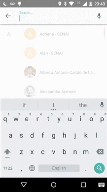
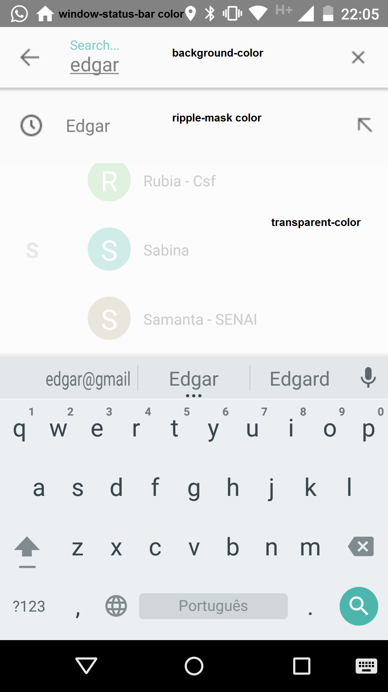

# Current Version: [  ](https://bintray.com/edsilfer/maven/custom-searchable/_latestVersion)
This library is in test phase, if you find any bugs, please report as an issue

# Table of Contents
* [Introduction](#intro)
* [Showcase](#showcase)
* [How to use](#how-to-use)
* [Quicky setup](#quicky-setup)
* [Cursor Columns](#columns)
* [Customizing the Searchable Interface](#customizing-searchable-ui)
* [TODO List](#to-do)
* [Team Members](#team-members)
* [License](#license)
 
# <a name="intro"></a>Introduction
Often apps need to offer the user a place where to search for content related to the current application. Building a good user interface to stand for this behavior might be anoying or simply do not fit in the developer's time window. Thinking in those situations, Custom Searchable is a library that intends to offer a clean gmail-like search interface. 

_Why should I use Custom Searchable instead of Android Search Interface?_

[Android Search Interface](http://developer.android.com/guide/topics/search/search-dialog.html) is good, however, it might be hard - or even impossible - to customize the UI components. Custom Searchable library, in the other hand, provides an easy to configure interface through which the developer can customize some of the UI elements.
 
# <a name="showcase"></a>Showcase
<p align="center">

</p>


# <a name="how-to-use"></a>How to use
As said before, this library was build upon the same model as [Android Search Interface](http://developer.android.com/guide/topics/search/search-dialog.html) (or at least I've tried to do so), therefore it is implied that the control of the content to display, as result to the user search, is of developer's responsability. There are basically two types of content that can be displayed: 

 - **Recent Suggestions:** displays suggestions based on the user recent typed queries;
 - **Custom Suggestions:** performs some processing over the user's typed data and deliveries some feedback based on its result;

Both methods discribed above work with Content Providers, if you never have worked with them I suggest read [this](http://developer.android.com/guide/topics/providers/content-provider-creating.html) article before continuing.

# <a name="quicky-setup">**Quicky set-up:**
 - **Add the library as dependency**: currently it is only hosted at JCenter repository (but it should be enought right?):
```
repositories {
    repositories {
        jcenter()
    }
}

dependencies {
    compile 'br.com.edsilfer:custom-searchable:0.0.6-Beta'
}
```

 - **Create a provider**: it will be queried to show suggestions to your app's user (the cursor that you'll delivery as a response of the query method shall have the columns dicribed in the [columns](#columns) section). You can refer to [RecentSuggestionsProvider ](demo/src/main/java/br/com/edsilfer/content_provider/RecentSuggestionsProvider.java) or [CustomSuggestionsProvider ](demo/src/main/java/br/com/edsilfer/content_provider/CustomSuggestionsProvider.java) for content providers implementation examples - you can also check out this official [tutorial](http://developer.android.com/guide/topics/search/adding-custom-suggestions.html);;
 
 - **Register the provider in your ```AndroidManifest.xml``` file**: keep in mind that in the case where you have multiple content providers, the one that extends ```SearchRecentSuggestionsProvider``` will always have priority. In case that you have multiple custom content providers (and none that descends from ```SearchRecentSuggestionsProvider```), the last declared will be take into consideration when quering. Example:
  ```xml
  <provider android:name=".content_provider.RecentSuggestionsProvider"
    android:authorities="br.com.edsilfer.content_provider.RecentSuggestionsProvider" />
  
  <provider android:name=".content_provider.CustomSuggestionsProvider"
   android:authorities="br.com.edsilfer.content_provider.CustomSuggestionsProvider" />
  ```
 - **Set your searchable activity**: searchable activity is the one that will receive the intents with the user typed data and/or the selected suggestion list item. To set your activity as searchable, just register it to receive the intents ```Intent.ACTION_SEARCH```;

 - **Handle the response intents**: In your searchable activity class, add code for handling the search intent:
```java
    // Handles the intent that carries user's choice in the Search Interface
    private void handleIntent(Intent intent) {
        if (Intent.ACTION_SEARCH.equals(intent.getAction())) {
            // Receives typed query
            String query = intent.getStringExtra(SearchManager.QUERY);
            
            // Do complex processing ...
        } else if (Intent.ACTION_VIEW.equals(intent.getAction())) {
            // Receives suggested clicked item
            Bundle bundle = this.getIntent().getExtras();
            
            if (bundle != null) {
                ResultItem receivedItem = bundle.getParcelable(CustomSearchableConstants.CLICKED_RESULT_ITEM);

                // Do complex processing
            }
        }
    }
```

PS1.: Note that the POJO class ```ResultItem``` holds the abstraction for the information present in one suggestion line;
 
 - **Customize the search activity layout**: see customizing the layout [section](#customizing-searchable-ui");

 - **Call the SearchActivity**: call ```startActivity()``` passing it an Intent;

# <a name="columns">**Cursor columns**
The custom-searchable library queries a content provider everytime that the user types a new letter in the search content. As a result of this query, based on the content provider interface contract, a cursor shall be returned to it. This cursor **must** contain the following columns:

 - ```java SearchManager.SUGGEST_COLUMN_TEXT_1```: stores the information to be displayed in the result-item first line;
 - ```java SearchManager.SUGGEST_COLUMN_TEXT_2```: stores the information to be displayed in the result-item seconde line (when set to work in two-line mode);
 - ```java SearchManager.SUGGEST_COLUMN_ICON_1```: stores the Resource ID for the result-item left icon;
 - ```javaSearchManager.SUGGEST_COLUMN_ICON_2```: stores the Resource ID for the result-item right icon;

PS2: ```SearchManager``` is an OOTB class of Android, to use its columns constants add ```java import android.app.SearchManager;``` in your class;

# <a name="customizing-searchable-ui">**Customizing the Searchable Interface**
The class ```CustomSearchableInfo``` provides the following attributes that helps you to customize your search interface:

<p align="center">

</p>

 * ```barHeight```: sets the search bar header height (defaul it 56dp);
 * ```resultItemHeight```: sets the result item brought in the result list height (default is 60dp);
 * ```resultItemHeaderTextSize```: sets the result item header text size (default is 16dp);
 * ```resultItemSubheaderTextSize```: sets the result item sub-header (when working with two-line mode) text size (default is 14dp);
 * ```searchTextSize```: sets the search text text size (default is 14dp);
 * ```barDismissIcon```: sets the dismiss search activity icon (return button) (default is a left point arrow);
 * ```barMicIcon```: sets the mic image that trigger the speech-to-text api (default is mic icon from Lollipop);
 * ~~```simpleSuggestionsLeftIcon```: sets the result item left icon (default is a clock);~~
 * ~~```simpleSuggestionsRightIcon```: sets the result item right icon (default is a arrow point left up);~~
 * ```transparencyColor```: sets the transparency color that will overlay the bottom activity;
 * ```primaryColor```: background color for the search bar and result row item;
 * ```textPrimaryColor```: primary text color applied to the search text, header and subheader (when working with the two-line-mode);
 * ```textHintColor```: hint text color applied to the search text;
 * ~~```rippleEffectMaskColor```: mask color for the ripple effect;~~
 * ~~```rippleEffectWaveColor```: wave color for the ripple effect;~~
 * ```isTwoLineExhibition```: sets if the result list will bring one or two lines;

In order to customize the SearchActivity layout interface with those above attributes, just call the set for them from the class ```CustomSearchableInfo```.

# <a name="two-line-mode">**Working in two line mode**
The result-item list can work with one or two lines - the defaul is one line. If you want to work with two line, you've got to specify this behaviour through ```CustomSearchableInfo``` class. When working in the one-line mode, the library takes care of adding the queried words that the user have typed for you, hoewever, if you set your app to work with the two-line mode, you're the only who can decide what to put in the second line when storing it. So, you should implement the ```insert``` method right after receiving the query intent. Example:

```java
SearchSuggestions suggestions = new SearchSuggestions(this, MySuggestionsProvider.AUTHORITY, MySuggestionsProvider.MODE);
suggestions.saveRecentQuery(queryString, "Second Line Content");
```

# <a name="to-do"></a>TODO List
* ~~Upload library into JCenter/Maven;~~
* ~~Parse icons corresponding columns from return cursor of query method;~~
* Add text-complete as suggestions in the search input text;

# <a name="team-members"></a>Team Members
* "Fernandes S. Edgar" <fernandes.s.edgar@gmail.com>

# <a name="license"></a>License
Copyright 2015 Edgar da Silva Fernandes

Licensed under the Apache License, Version 2.0 (the "License");
you may not use this file except in compliance with the License.
You may obtain a copy of the License at

    http://www.apache.org/licenses/LICENSE-2.0

Unless required by applicable law or agreed to in writing, software
distributed under the License is distributed on an "AS IS" BASIS,
WITHOUT WARRANTIES OR CONDITIONS OF ANY KIND, either express or implied.
See the License for the specific language governing permissions and
limitations under the License.

